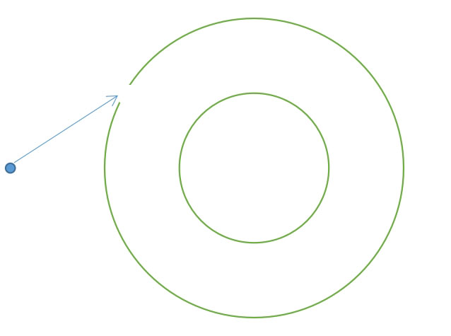

# ultrastrong magnetic field

## As shown in the picture, prepare a vacuum concentric tube, fill the inner layer with iron rods, connect the inner and outer layers to the positive and negative poles to form an electric field, and open a row of small holes on the outer layer for charged particles to enter. Adjust the strength of the electric field, the velocity, and the angle of the particles so that they can perform uniform circular motion in this annular electric field.
